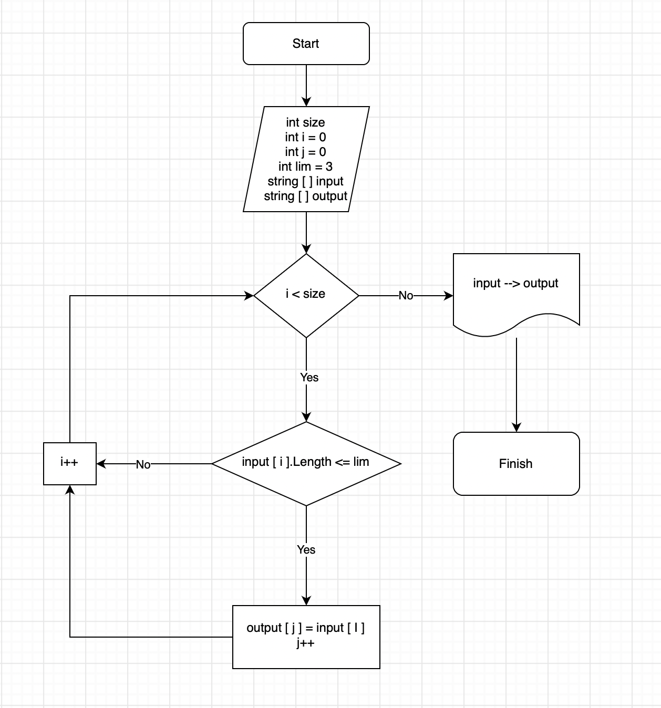

# Итоговая проверочная работа

## Задача

Написать программу, которая из имеющегося массива строк формирует новый массив из строк, длина которых меньше, либо равна 3 символам. Первоначальный массив можно ввести с клавиатуры, либо задать на старте выполнения алгоритма. При решении не рекомендуется пользоваться коллекциями,
лучше обойтись исключительно массивами.

**Примеры:** _[“Hello”, “2”, “world”, “:-)”] → [“2”, “:-)”]_

## Алгоритм решения

1. Просим пользователя ввести количество элементов, которые будут содержаться в массиве. Это будет размер исходного массива - переменная _size_.
2. Заполняем исходный массив случайными элементами. Каждый элемент состоит из случайного количества символов. См. метод _FillArray_.
3. Для определения размера нового массива, считаем количество элементов исходного массива, длина которых меньше, либо равна 3. См. метод _CountElementsOutputArray_.
4. Задаем условие, если количество элементов нового массива равно 0, то выводим исходный и пустой массив.
   В противном случае выводим исходный и новый массив, содержищий элементы, длина которых меньше, либо равна 3.

## Дополнительная информация

Добавили блок-схему алгоритма решения задачи

